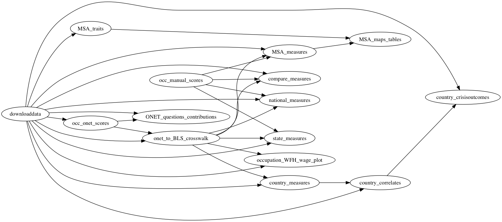

This repository contains the code underlying the note "[How Many Jobs Can be Done at Home?](DingelNeiman-workathome.pdf)" by Jonathan I. Dingel and Brent Neiman.
This is a complete replication package that produces all results from scratch,
beginning with [code](downloaddata/code/Makefile) that downloads all the required data from [bls.gov](https://www.bls.gov/) and [onetcenter.org](https://www.onetcenter.org/).

## Results

If you simply want to download our results without running any replication code, you can grab the following CSV files:
- [industry-level results](national_measures/output/NAICS_workfromhome.csv)
- [metropolitan-level results](MSA_measures/output/MSA_workfromhome.csv)
- [occupation-level results](occ_onet_scores/output/occupations_workathome.csv)

## Code organization

The workflow is organized as a series of tasks.
Each task folder contains three folders: `input`, `code`, `output`.
A task's output is used as an input by one or more downstream tasks.
[This graph](symlink_graph/output/task_flow.png) depicts the input-output relationships between tasks.

We use the [`make`](http://swcarpentry.github.io/make-novice/) utility to automate this workflow.
After downloading this replication package (and installing the relevant software), you can reproduce the figures and tables appearing in the paper simply by typing `make` at the command line.

## Software requirements
The project's tasks are implemented via [Stata](http://www.stata.com) code and shell scripts.
The taskflow structure employs [symbolic links](https://en.wikipedia.org/wiki/Symbolic_link).
To run the code, you must have installed Stata.
We ran our code using Stata 14 and GNU bash version 3.2.57 on Mac OS X.
We expect the code to work on other versions too.

## Replication instructions

### Download and run code

1. Download (or clone) this repository by clicking the green `Clone or download` button above.
Uncompress the ZIP file into a working directory on your cluster or local machine.
2. From the Unix/Linux/MacOSX command line, navigate to directory containing this readme.
3. Typing `make` will execute all the code. The `Makefile` will execute `stata-se` commands, so Mac OS X users should [ensure](https://www.stata.com/support/faqs/mac/advanced-topics/) `stata-se` is in their relevant `PATH`.

### Notes
- It is best to replicate the project using the `make` approach described above.
Nonetheless, it is also possible to produce the results task-by-task in the order depicted in the flow chart.
If all upstream tasks have been completed, you can complete a task by navigating to the task's `code` directory and typing `make`.
- An internet connection is required so that the `downloaddata` task can download data.
- If you want to create your own manual classification, edit the file [Teleworkable_BNJDopinion.csv](occ_manual_scores/input/Teleworkable_BNJDopinion.csv) before running the code.

## Acknowledgments

Thanks to Menglu Xu for research assistance.
Thanks to [Megan Fasules](https://github.com/mfasules) for spotting a bug in our initial code.
